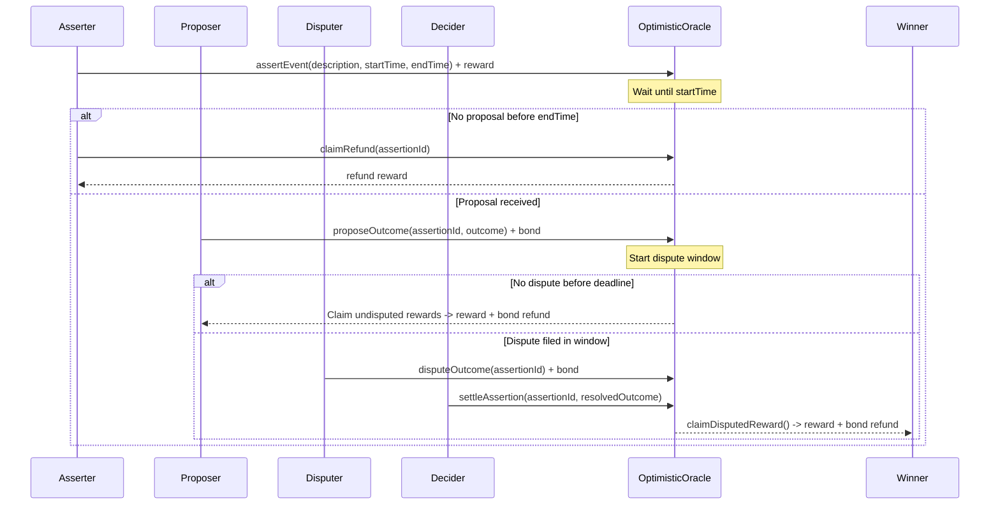

# 🏗 Scaffold-ETH 2

<h4 align="center">
  <a href="https://docs.scaffoldeth.io">Documentation</a> |
  <a href="https://scaffoldeth.io">Website</a>
</h4>

🧪 An open-source, up-to-date toolkit for building decentralized applications (dapps) on the Ethereum blockchain. It's designed to make it easier for developers to create and deploy smart contracts and build user interfaces that interact with those contracts.

⚙️ Built using NextJS, RainbowKit, Hardhat, Wagmi, Viem, and Typescript.

- ✅ **Contract Hot Reload**: Your frontend auto-adapts to your smart contract as you edit it.
- 🪝 **[Custom hooks](https://docs.scaffoldeth.io/hooks/)**: Collection of React hooks wrapper around [wagmi](https://wagmi.sh/) to simplify interactions with smart contracts with typescript autocompletion.
- 🧱 [**Components**](https://docs.scaffoldeth.io/components/): Collection of common web3 components to quickly build your frontend.
- 🔥 **Burner Wallet & Local Faucet**: Quickly test your application with a burner wallet and local faucet.
- 🔐 **Integration with Wallet Providers**: Connect to different wallet providers and interact with the Ethereum network.


## Requirements

Before you begin, you need to install the following tools:

- [Node (>= v20.18.3)](https://nodejs.org/en/download/)
- Yarn ([v1](https://classic.yarnpkg.com/en/docs/install/) or [v2+](https://yarnpkg.com/getting-started/install))
- [Git](https://git-scm.com/downloads)

# 🔮 Oracle Challenge


🔗 Build your own decentralized oracle systems! In this challenge, you'll explore three fundamental oracle architectures that power the decentralized web: **Whitelist Oracle**, **Staking Oracle**, and **Optimistic Oracle**.

🧠 You'll dive deep into the mechanics of bringing real-world data onto the blockchain, understanding the critical trade-offs between security, decentralization, and efficiency. Each oracle design represents a different approach to solving the fundamental problem: How can we trust data from outside the blockchain, and how do we securely bring it on-chain?

<details markdown='1'><summary>❓ Wondering what an oracle is? Read the overview here.</summary>

Oracles are bridges between blockchains and the external world. They solve a fundamental problem: smart contracts can only access data that exists on the blockchain, but most real-world data (prices, weather, sports scores, etc.) exists off-chain.

🤔 Why are oracles important?

- **DeFi Protocols**: Need accurate price feeds for lending, trading, and liquidation
- **Insurance**: Require real-world event verification (weather, flight delays)
- **Gaming**: Need random numbers and external event outcomes
- **Supply Chain**: Track real-world goods and events

🔒 Why are oracles difficult?

- **Trust**: How do we know the oracle is telling the truth?
- **Centralization**: Single points of failure can compromise entire protocols
- **Incentives**: How do we align oracle behavior with protocol needs?
- **Latency**: Real-time data needs to be fresh and accurate

👍 Now that you understand the basics, let's look at three different oracle systems!

</details>

---

🌟 The final deliverable is a comprehensive understanding of oracle architectures through hands-on implementation. You'll explore three oracle systems, a Whitelist oracle, Staking-based oracle and an Optimistic oracle, implementing each one. In the end you will deploy your optimistic oracle to a testnet and demonstrate how it handles assertions, proposals, disputes, and settlements.

🔍 First, let's understand why we need multiple oracle designs. Each approach has different strengths:

- **Whitelist Oracle**: Simple and fast, but requires trust in a centralized authority
- **Staking Oracle**: Decentralized with economic incentives, but more complex
- **Optimistic Oracle**: Dispute-based with strong security guarantees, but higher latency

📚 This challenge is inspired by real-world oracle systems like [Chainlink](https://chain.link/), [Pyth Network](https://www.pyth.network/), and [UMA Protocol](https://uma.xyz/).

💬 Meet other builders working on this challenge and get help in the [Oracle Challenge Telegram](https://t.me/+AkmcMB3jC3A0NDcx)

---

## Checkpoint 0: 📦 Environment 📚

> 💻 Start your local network (a blockchain emulator in your computer):

```sh
yarn chain
```

> 🛰️ In a second terminal window, deploy your contract (locally):

```sh
yarn deploy
```

> 📱 In a third terminal window, start your frontend:

```sh
yarn start
```

📱 Open http://localhost:3000 to see the app.

> 👩‍💻 Rerun `yarn deploy` whenever you want to deploy new contracts to the frontend. If you haven't made any contract changes, you can run `yarn deploy --reset` for a completely fresh deploy.

---

## Checkpoint 1: 🏛️ Whitelist Oracle Overview

🔍 Let's start with the simplest of the three oracle designs we'll cover: the Whitelist Oracle. This design uses a centralized authority to control which data sources can provide information, making it simple and fast but requiring trust.

💰 The implementation we'll be looking at is a **price** oracle. Price oracles are one of the most common and critical types of oracles in DeFi, as they enable smart contracts to make decisions based on real-world asset prices. Our whitelist price oracle collects price reports from multiple trusted sources (instances of `SimpleOracle`) and returns their median value.

🧭 Let's understand how this oracle system works. We'll examine both the basic building block (SimpleOracle) and how multiple simple oracles can be combined into a more robust system (WhitelistOracle).

### 🔗 Simple Oracle - The Building Block

🔍 Open the `packages/hardhat/contracts/00_Whitelist/SimpleOracle.sol` file to examine the basic oracle functionality.

#### 📖 Understanding the Code:

🧩 The `SimpleOracle` contract is the fundamental building block of this oracle system:

1. **Constructor** - Takes an `_owner` address parameter to set who can update the oracle price

2. **`setPrice(uint256 _newPrice)`** - This function allows the contract owner to update the current price

   * 🔄 Updates the `price` state variable with the new value

   * ⏱️ Updates the `timestamp` to the current block timestamp

   * 📣 Emits the `PriceUpdated` event with the new price

3. **`getPrice()`** - This function returns both the current price and timestamp

   * ↩️ Returns them as a tuple: `(price, timestamp)`

#### 🤔 Key Insights:

- **Single Source**: Each SimpleOracle represents one data source
- **Trust Model**: Requires complete trust in whoever updates the price
- **Limitations**: No consensus mechanism, no economic incentives

### 🏛️ Whitelist Oracle - Aggregating Multiple Sources

🎯 **Your Mission**: Complete the missing function implementations in the `WhitelistOracle.sol` contract.

🔍 Open the `packages/hardhat/contracts/00_Whitelist/WhitelistOracle.sol` file to implement the whitelist oracle functionality.

#### 📖 Understanding the Relationship:

The `WhitelistOracle` contract **creates and manages multiple SimpleOracle contracts**:

```solidity

SimpleOracle[] public oracles;  // Array of SimpleOracle contract instances

```

🏗️ This creates a **hierarchical oracle system**:

- **Individual Level**: Each SimpleOracle contract is managed by a trusted data provider (set during oracle creation)
- **Aggregation Level**: The WhitelistOracle creates, manages, and processes data from all whitelisted SimpleOracle contracts

### ✏️ Tasks:

1. **Implement `addOracle(address _owner)`**

* 🏭 This function allows the contract owner to add a new oracle to the whitelist by deploying a SimpleOracle contract

* 🧩 It should create a new `SimpleOracle` instance with the specified `_owner`

* ➕ It should add the newly created SimpleOracle to the `oracles` array

* 📣 It should emit the `OracleAdded` event with both the oracle address and its owner

<details markdown='1'>

<summary>💡 Hint: Creating and Adding Oracles</summary>

Here's what you need to do:
- Create a new SimpleOracle contract instance using `new SimpleOracle(_owner)`
- Get the address of the newly created oracle using `address(newOracle)`
- Push the oracle instance to the `oracles` array
- Emit the `OracleAdded` event with the oracle address and owner

<details markdown='1'>

<summary>🎯 Solution</summary>

```solidity
function addOracle(address _owner) public onlyOwner {
    SimpleOracle newOracle = new SimpleOracle(_owner);
    address oracleAddress = address(newOracle);

    oracles.push(newOracle);
    emit OracleAdded(oracleAddress, _owner);
}
```

</details>
</details>

---

2. **Implement `removeOracle(uint256 index)`**

* ✔️ This function allows the contract owner to remove an oracle from the whitelist by its array index

* 🔍 It should validate that the provided index is within bounds, otherwise revert with `IndexOutOfBounds`

* 📝 It should record the oracle address before removal for the event

* ➖ It should efficiently remove the oracle using swap-and-pop pattern (swap with last element, then pop)

* 📣 It should emit the `OracleRemoved` event with the oracle address

<details markdown='1'>

<summary>💡 Hint: Safe Array Removal</summary>

The swap-and-pop pattern:
- Check if index is valid (< oracles.length)
- Store the oracle address for the event
- If not the last element, swap with the last element
- Pop the last element
- Emit the removal event

<details markdown='1'>

<summary>🎯 Solution</summary>

```solidity
function removeOracle(uint256 index) public onlyOwner {
    if (index >= oracles.length) revert IndexOutOfBounds();

    address oracleAddress = address(oracles[index]);

    if (index != oracles.length - 1) {
        oracles[index] = oracles[oracles.length - 1];
    }

    oracles.pop();

    emit OracleRemoved(oracleAddress);
}
```

</details>
</details>

---

3. **Implement `getPrice()`**

* 📊 This function aggregates prices from all active oracles using median calculation

* ⛔️ It should revert with `NoOraclesAvailable` if no oracles exist in the whitelist

* 🔁 It should loop through each oracle and call `getPrice()` to get `(price, timestamp)`

* 🧹 It should filter out stale prices (older than `STALE_DATA_WINDOW = 24 seconds`)

* 📦 It should collect only fresh prices into a properly sized array

* 🧮 It should use StatisticsUtils library to sort prices and calculate the median

<details markdown='1'>

<summary>💡 Hint: Price Aggregation with Freshness Check</summary>

Here's the process:
- Check if any oracles exist
- Create a temporary array to collect fresh prices
- Loop through all oracles, get their (price, timestamp)
- Check if timestamp is within STALE_DATA_WINDOW of current time
- Collect valid prices and count them
- Create a right-sized array with only valid prices
- Sort and get median using StatisticsUtils

<details markdown='1'>

<summary>🎯 Solution</summary>

```solidity
function getPrice() public view returns (uint256) {
    if (oracles.length == 0) revert NoOraclesAvailable();

    // Collect prices and timestamps from all oracles
    uint256[] memory prices = new uint256[](oracles.length);
    uint256 validCount = 0; // Count of valid prices
    uint256 currentTime = block.timestamp;

    for (uint256 i = 0; i < oracles.length; i++) {
        (uint256 price, uint256 timestamp) = oracles[i].getPrice();
        // Check if the timestamp is within the last STALE_DATA_WINDOW
        if (currentTime - timestamp < STALE_DATA_WINDOW) {
            prices[validCount] = price;
            validCount++;
        }
    }

    uint256[] memory validPrices = new uint256[](validCount);
    for (uint256 i = 0; i < validCount; i++) {
        validPrices[i] = prices[i];
    }

    validPrices.sort();
    return validPrices.getMedian();
}
```

</details>
</details>

---

4. **Implement `getActiveOracleNodes()`**

* 📊 This function returns the addresses of all oracles that have updated their price within the last `STALE_DATA_WINDOW`

* 🔍 It should iterate through all oracles and filter those with recent timestamps

* 📦 It should use a temporary array to collect active nodes, then create a right-sized return array for gas optimization

* 🎯 It should return an array of addresses representing the currently active oracle contracts

<details markdown='1'>

<summary>💡 Hint: Active Node Filtering</summary>

Similar to getPrice(), but instead of collecting prices, collect oracle addresses:
- Create temporary array to store addresses
- Loop through oracles, check timestamp freshness
- Count and collect active oracle addresses
- Create properly sized result array
- Return the active oracle addresses

<details markdown='1'>

<summary>🎯 Solution</summary>

```solidity
function getActiveOracleNodes() public view returns (address[] memory) {
    address[] memory tempNodes = new address[](oracles.length);
    uint256 count = 0;

    for (uint256 i = 0; i < oracles.length; i++) {
        (, uint256 timestamp) = oracles[i].getPrice();
        if (timestamp > block.timestamp - STALE_DATA_WINDOW) {
            tempNodes[count] = address(oracles[i]);
            count++;
        }
    }

    address[] memory activeNodes = new address[](count);
    for (uint256 j = 0; j < count; j++) {
        activeNodes[j] = tempNodes[j];
    }

    return activeNodes;
}
```

</details>
</details>

### 🤔 Key Insights:

- **Factory Pattern**: WhitelistOracle creates and manages SimpleOracle contracts
- **Centralized Authority**: Only the owner can add/remove SimpleOracle contracts
- **Consensus Mechanism**: Uses median calculation with StatisticsUtils library to resist outliers
- **Freshness Check**: Filters out stale data from any SimpleOracle
- **Trust Model**: Requires trust in the whitelist authority and each SimpleOracle provider
- **Use Cases**: Good for controlled environments where you trust the centralized entity or where things fall back to the rule of law (RWAs)

### 🔄 How They Work Together:

1. **Data Flow**:

```

SimpleOracle A → setPrice(100) → getPrice() → (100, timestamp)

SimpleOracle B → setPrice(102) → getPrice() → (102, timestamp)

SimpleOracle C → setPrice(98)  → getPrice() → (98, timestamp)

```

2. **Aggregation**:

```

WhitelistOracle → getPrice() → [100, 102, 98] → sort → [98, 100, 102] → median(100) → 100

```

3. **Benefits**:

- **Redundancy**: If one SimpleOracle fails, others continue providing data

- **Outlier Resistance**: Median calculation ignores extreme values

- **Freshness**: Stale data from any SimpleOracle is filtered out

### 🤔 Critical Thinking: Security Vulnerabilities

- **Question**: How could this whitelist oracle design be exploited or taken advantage of? What are the main attack vectors?

<details markdown='1'>

<summary>💡 Click to see potential vulnerabilities</summary>

1. 🔓 **Whitelist Authority Compromise**: If the owner's private key is compromised, an attacker could:

   - Remove all legitimate oracles and add malicious ones

   - Manipulate which data sources are trusted

   - Add multiple oracles they control to skew the median

2. 👥 **Collusion Among Whitelisted Providers**: If enough whitelisted oracle providers collude, they could:

   - Report coordinated false prices to manipulate the median

   - Extract value from protocols relying on the oracle

3. 🔓 **Data Provider Compromise**: Individual SimpleOracle operators could:

   - Be hacked or coerced to report false prices

   - Sell their influence to manipulators

💡 *Real-World Impact*: These vulnerabilities explain why protocols like [MakerDAO/Sky](https://github.com/sky-ecosystem/medianizer) eventually moved to more decentralized oracle systems as the stakes grew higher!

</details>

---

### Testing your progress

🔍 Run the following command to check if you implemented the functions correctly.

```sh

yarn test --grep "Checkpoint1"

```

✅ Did the tests pass? You can dig into any errors by viewing the tests at `packages/hardhat/test/WhitelistOracle.ts`.

### Try it out!

🔄 Run `yarn deploy --reset` then test the whitelist oracle. Try adding and removing oracles, and observing how the aggregated price changes.

👊 Notice how the onlyOwner modifiers are commented out to allow you to have full control. Try manually changing the price of individual SimpleOracle contracts and adding new oracle nodes to see how the aggregated price changes:

1. **Change Prices**: Use the frontend to modify individual oracle prices

2. **Add New Nodes**: Create new SimpleOracle contracts through the whitelist oracle

3. **Observe Aggregation**: Watch how the median price changes as you add/remove oracles

🧪 **Live Simulation**: Run the `yarn simulate:whitelist` command to see what a live version of this protocol might look like in action:

```sh

yarn simulate:whitelist

```

🤖 This will start automated bots that simulate real oracle behavior, showing you how the system would work in production with multiple active price feeds.

### 🥅 Goals:

- You can add new SimpleOracle instances to the whitelist
- System aggregates prices from active oracles using median calculation
- Stale data is automatically filtered out based on timestamps
- You can query which oracle nodes are currently active
- The system correctly handles edge cases and invalid states
- Understand the benefits of aggregating multiple data sources
- Look at these examples "in the wild" from early DeFi: [Simple Oracle](https://github.com/dapphub/ds-value), 
[Whitelist Oracle](https://github.com/sky-ecosystem/medianizer)

---

## Checkpoint 2: 💰 Staking Oracle - Economic Incentives

🧭 Now let's explore a decentralized oracle that uses economic incentives to ensure honest behavior. Nodes stake ETH to participate and can be slashed for reporting prices that deviate too far from the average. The system uses a bucket-based approach where prices are organized into discrete time windows (24 blocks per bucket), and nodes must report once per bucket or else there will be a small inactivity leak in their stake. We will also issue rewards in the form of an ERC20 token called ORA (1 ORA per report) to incentivise participation in the system.

👩‍💻 This section challenges you to implement the staking oracle system from scratch. You'll write the core functions that handle node registration, bucket-based price reporting, reward distribution based on report count, and slashing mechanisms for price deviations.

🎯 **Your Mission**: Complete the missing function implementations in the `StakingOracle.sol` contract. The contract skeleton is already provided with all the necessary structs, events, and modifiers but you need to fill in the logic.

🔍 Open the `packages/hardhat/contracts/01_Staking/StakingOracle.sol` file to implement the staking oracle functionality.

### ✏️ Tasks:

1. **Implement `getCurrentBucketNumber()`**

* 🕒 This view function maps the current `block.number` into a bucket index (24-block window)

* 🧮 It should divide the block number by `BUCKET_WINDOW` and add 1 (buckets are indexed starting from 1, not 0)

<details markdown='1'>

<summary>💡 Hint: Bucket Number</summary>

- Buckets advance every `BUCKET_WINDOW` blocks
- Integer division will floor the result automatically
- Remember to add 1 so the very first bucket starts at index 1

<details markdown='1'>

<summary>🎯 Solution</summary>

```solidity
function getCurrentBucketNumber() public view returns (uint256) {
    return (block.number / BUCKET_WINDOW) + 1;
}
```

</details>
</details>

---

2. **Implement `getEffectiveStake(address nodeAddress)`**

* 📉 This view function returns a node's stake after inactivity penalties

* 🔍 It should return `0` for inactive nodes

* 🧮 It should compute expected reports based on completed buckets since registration

* ✂️ For each missed report, subtract `INACTIVITY_PENALTY`, floored at zero

<details markdown='1'>

<summary>💡 Hint: Effective Stake</summary>

- Load the node into memory for cheaper reads
- If the node is inactive, return `0`
- Determine `currentBucket` using `getCurrentBucketNumber()`
- Expected reports = `currentBucket - n.firstBucket`
- Use `n.reportCount` as completed reports but subtract one if the last report happened in the current bucket (it isn't completed yet)
- Penalty = `missed * INACTIVITY_PENALTY`; cap at the staked amount

<details markdown='1'>

<summary>🎯 Solution</summary>

```solidity
function getEffectiveStake(address nodeAddress) public view returns (uint256) {
    OracleNode memory n = nodes[nodeAddress];
    if (!n.active) return 0;
    uint256 currentBucket = getCurrentBucketNumber();
    if (currentBucket == n.firstBucket) return n.stakedAmount;
    uint256 expectedReports = currentBucket - n.firstBucket;
    uint256 actualReportsCompleted = n.reportCount;
    if (n.lastReportedBucket == currentBucket && actualReportsCompleted > 0) {
        actualReportsCompleted -= 1;
    }
    if (actualReportsCompleted >= expectedReports) return n.stakedAmount;
    uint256 missed = expectedReports - actualReportsCompleted;
    uint256 penalty = missed * INACTIVITY_PENALTY;
    if (penalty > n.stakedAmount) return 0;
    return n.stakedAmount - penalty;
}
```

</details>
</details>

---

3. **Implement `registerNode(uint256 price)`**

* 🏗️ This function allows users to register as oracle nodes by staking ETH

* ⚠️ It should require a minimum stake of 1 ETH, otherwise revert with `InsufficientStake`

* 🧪 It should check that the node is not already registered, otherwise revert with `NodeAlreadyRegistered`

* 🏗️ It should create a new `OracleNode` struct with the correct data

* ➕ It should add the node address to the `nodeAddresses` array

* 💲 It should call `reportPrice(price)` (you'll implement this later) to record the first report in the current bucket

* 📣 It should emit the `NodeRegistered` event

<details markdown='1'>

<summary>💡 Hint: Node Registration</summary>

Here's what you need to set in the `OracleNode` struct:
- `stakedAmount` should be `msg.value`
- `lastReportedBucket` should be `0` (will be updated in `reportPrice`)
- `reportCount` should be `0`
- `claimedReportCount` should be `0`
- `firstBucket` should be `getCurrentBucketNumber()` (the bucket when the node registered)
- `active` should be `true`

After creating the struct, push the node into `nodeAddresses`, call `reportPrice(price)`, and emit the event.

<details markdown='1'>

<summary>🎯 Solution</summary>

```solidity
function registerNode(uint256 price) public payable {
    if (msg.value < MINIMUM_STAKE) revert InsufficientStake();
    if (nodes[msg.sender].active) revert NodeAlreadyRegistered();
    nodes[msg.sender] = OracleNode({
        stakedAmount: msg.value,
        lastReportedBucket: 0,
        reportCount: 0,
        claimedReportCount: 0,
        firstBucket: getCurrentBucketNumber(),
        active: true
    });
    nodeAddresses.push(msg.sender);
    reportPrice(price);
    emit NodeRegistered(msg.sender, msg.value);
}
```

</details>
</details>

---

4. **Implement `addStake()`**

* 💸 This payable function lets an active node increase its stake

* ⚠️ It should revert with `InsufficientStake` if `msg.value == 0`

* ➕ It should add the sent value to the node's `stakedAmount`

* 📣 It should emit the `StakeAdded` event

<details markdown='1'>

<summary>💡 Hint: Adding Stake</summary>

- Use the `onlyNode` modifier to ensure sender is active
- Update `nodes[msg.sender].stakedAmount`
- Emit `StakeAdded`

<details markdown='1'>

<summary>🎯 Solution</summary>

```solidity
function addStake() public payable onlyNode {
    if (msg.value == 0) revert InsufficientStake();
    nodes[msg.sender].stakedAmount += msg.value;
    emit StakeAdded(msg.sender, msg.value);
}
```

</details>
</details>

---

5. **Implement `reportPrice(uint256 price)`**

* 🧪 This function allows registered nodes to report new prices (uses `onlyNode` modifier)

* 🔍 It should verify the given price is not zero, otherwise revert with `InvalidPrice`

* 🔍 It should verify the node has sufficient stake (using `getEffectiveStake`), otherwise revert with `InsufficientStake`

* 🚫 It should prevent reporting twice in the same bucket, otherwise revert with `AlreadyReportedInCurrentBucket`

* 📊 It should store the node's price in the current bucket's `TimeBucket` mapping

* 📈 It should increment the bucket's `countReports` and add the price to `sumPrices`. This will be useful for deriving the average later

* 🔄 It should update the node's `lastReportedBucket` and `reportCount`

* 📣 It should emit the `PriceReported` event with the sender, price, and bucket number

<details markdown='1'>

<summary>💡 Hint: Price Reporting</summary>

- Pull `OracleNode storage node = nodes[msg.sender]`
- Validate price and stake before touching bucket state
- Use `timeBuckets[getCurrentBucketNumber()]`
- Update bucket mappings and aggregates
- Update the node's `lastReportedBucket` to `getCurrentBucketNumber()`
- Increment the node's `reportCount`

<details markdown='1'>

<summary>🎯 Solution</summary>

```solidity
function reportPrice(uint256 price) public onlyNode {
    if (price == 0) revert InvalidPrice();
    OracleNode storage node = nodes[msg.sender];
    if (getEffectiveStake(msg.sender) < MINIMUM_STAKE) revert InsufficientStake();
    if (node.lastReportedBucket == getCurrentBucketNumber()) revert AlreadyReportedInCurrentBucket();
    TimeBucket storage bucket = timeBuckets[getCurrentBucketNumber()];
    bucket.prices[msg.sender] = price;
    bucket.countReports++;
    bucket.sumPrices += price;

    node.lastReportedBucket = getCurrentBucketNumber();
    node.reportCount++;
    emit PriceReported(msg.sender, price, getCurrentBucketNumber());
}
```

</details>
</details>

---

6. **Implement `claimReward()`**

* 🧪 This function allows past and present nodes to claim their ORA token rewards

* 🔍 It should calculate reward amount based on the difference between `reportCount` and `claimedReportCount`. We will call this number the `delta`

* 🔒 It should revert with `NoRewardsAvailable` if `delta == 0`

* 🔢 It should update `claimedReportCount` to `reportCount` *before* minting the tokens (reentrancy safe)

* 💰 It should mint `delta * REWARD_PER_REPORT` ORA tokens

* 📣 It should emit the `NodeRewarded` event

<details markdown='1'>

<summary>💡 Hint: Reward Implementation</summary>

- Load the node in storage
- Compute `delta`
- Revert if `delta == 0`
- Update `claimedReportCount`
- Mint the reward and emit the event

<details markdown='1'>

<summary>🎯 Solution</summary>

```solidity
function claimReward() public {
    OracleNode storage node = nodes[msg.sender];

    uint256 delta = node.reportCount - node.claimedReportCount;
    if (delta == 0) revert NoRewardsAvailable();

    node.claimedReportCount = node.reportCount;
    oracleToken.mint(msg.sender, delta * REWARD_PER_REPORT);
    emit NodeRewarded(msg.sender, delta * REWARD_PER_REPORT);
}
```

</details>
</details>

---

7. **Implement `_removeNode(address nodeAddress, uint256 index)`**

* 🗂️ This internal function removes a node from the `nodeAddresses` array while keeping the array packed. By forcing the caller to provide the index and simply verifying it is at that position we are removing the need to iterate over a potentially large array

* 🔍 It should ensure the provided `index` is within bounds, otherwise revert with `IndexOutOfBounds`

* ✅ It should ensure the address at the given index matches `nodeAddress`, otherwise revert with `NodeNotAtGivenIndex`

* 🔁 It should use the pop-and-swap pattern to remove the entry efficiently

* 🚫 It should mark the node as inactive without deleting the entire struct (other functions may rely on historical data)

<details markdown='1'>

<summary>💡 Hint: Removing Nodes</summary>

- Check `index < nodeAddresses.length`
- Check `nodeAddresses[index] == nodeAddress`
- Assign the last address into the `index` slot, then pop
- Set `nodes[nodeAddress].active = false`

<details markdown='1'>

<summary>🎯 Solution</summary>

```solidity
function _removeNode(address nodeAddress, uint256 index) internal {
    if (nodeAddresses.length <= index) revert IndexOutOfBounds();
    if (nodeAddresses[index] != nodeAddress) revert NodeNotAtGivenIndex();
    nodeAddresses[index] = nodeAddresses[nodeAddresses.length - 1];
    nodeAddresses.pop();
    nodes[nodeAddress].active = false;
}
```

</details>
</details>

---

8. **Implement `_checkPriceDeviated(uint256 reportedPrice, uint256 averagePrice)`**

* 🧮 This internal pure function determines whether a reported price deviates beyond the allowed threshold

* 🔢 It should compute the absolute difference between the reported price and the average

* 📐 It should convert the deviation to basis points and compare it against `MAX_DEVIATION_BPS`

* 🔁 It should return `true` when the deviation is greater than the threshold, otherwise `false`

<details markdown='1'>

<summary>💡 Hint: Deviation Check</summary>

- Use a simple conditional to compute the absolute deviation
- Multiply the deviation by 10,000 (basis points) before dividing by `averagePrice`. This will allow for greater precision
- Compare the result against `MAX_DEVIATION_BPS`

<details markdown='1'>

<summary>🎯 Solution</summary>

```solidity
function _checkPriceDeviated(uint256 reportedPrice, uint256 averagePrice) internal pure returns (bool) {
    uint256 deviation = reportedPrice > averagePrice ? reportedPrice - averagePrice : averagePrice - reportedPrice;
    uint256 deviationBps = (deviation * 10_000) / averagePrice;
    if (deviationBps > MAX_DEVIATION_BPS) {
        return true;
    }
    return false;
}
```

</details>
</details>

---

9. **Implement `slashNode(address nodeToSlash, uint256 bucketNumber, uint256 index)`**

* 🔎 This function allows anyone to slash nodes that reported prices deviating too far from the average

* 🧪 It should verify the node is active, otherwise revert with `NodeNotRegistered`

* ⏰ It should verify the bucket is in the past (not current), otherwise revert with `OnlyPastBucketsAllowed`

* 🚫 It should verify the node hasn't already been slashed in this bucket, otherwise revert with `NodeAlreadySlashed`

* 📊 It should verify the node reported a price in this bucket, otherwise revert with `NodeDidNotReport`

* ✂️ It should mark the node as slashed and remove their price from the bucket's sum and count

* 🧮 It should recalculate the average price after removing the node's price

* 🔍 It should verify the node's price deviates beyond the threshold using `_checkPriceDeviated`, otherwise revert with `NotDeviated`

* 💰 It should slash the node by `MISREPORT_PENALTY` (or their full stake if less)

* 🏅 It should send 10% of the penalty to the slasher (`msg.sender`)

* 🗑️ It should remove the node if their stake reaches zero after slashing using `_removeNode`

* ⚠️ It should revert with `FailedToSend` if the reward transfer fails

* 📣 It should emit `NodeSlashed` and `NodeExited` (if the node is removed)

<details markdown='1'>

<summary>💡 Hint: Complete Slashing Implementation</summary>

Follow these steps:
- Validate node state and bucket recency
- Ensure the node actually reported in that bucket and hasn't been slashed yet
- Remove their contribution from `sumPrices`/`countReports`
- Recompute the average (excluding the offender) and check deviation with `_checkPriceDeviated`
- Apply the penalty by reducing the node's `stakedAmount`
- If the node is fully slashed (`stakedAmount` == 0), remove them with `_removeNode`
- Calculate the reward, and transfer it

<details markdown='1'>

<summary>🎯 Solution</summary>

```solidity
function slashNode(address nodeToSlash, uint256 bucketNumber, uint256 index) public {
    if (!nodes[nodeToSlash].active) revert NodeNotRegistered();
    if (getCurrentBucketNumber() == bucketNumber) revert OnlyPastBucketsAllowed();
    TimeBucket storage bucket = timeBuckets[bucketNumber];
    if (bucket.slashedOffenses[nodeToSlash]) revert NodeAlreadySlashed();
    uint256 reportedPrice = bucket.prices[nodeToSlash];
    if (reportedPrice == 0) revert NodeDidNotReport();
    bucket.slashedOffenses[nodeToSlash] = true;
    bucket.sumPrices -= reportedPrice;
    bucket.countReports--;
    uint256 averagePrice = bucket.sumPrices / bucket.countReports;
    if (!_checkPriceDeviated(reportedPrice, averagePrice)) {
        revert NotDeviated();
    }
    OracleNode storage node = nodes[nodeToSlash];
    uint256 actualPenalty = MISREPORT_PENALTY > node.stakedAmount ? node.stakedAmount : MISREPORT_PENALTY;
    node.stakedAmount -= actualPenalty;

    uint256 reward = (actualPenalty * SLASHER_REWARD_PERCENTAGE) / 100;

    (bool sent, ) = msg.sender.call{ value: reward }("");
    if (!sent) revert FailedToSend();

    if (node.stakedAmount == 0) {
        _removeNode(nodeToSlash, index);
        emit NodeExited(nodeToSlash, 0);
    }

    emit NodeSlashed(nodeToSlash, actualPenalty);
}
```

</details>
</details>

---

10. **Implement `exitNode(uint256 index)`**

* 🚪 This function allows a node to exit and withdraw its stake after a waiting period

* ⏳ It should ensure the node waited at least `WAITING_PERIOD` buckets since their last report, otherwise revert with `WaitingPeriodNotOver`. This way there is ample time to slash them before they exit

* 💰 It should compute the withdrawable stake using `getEffectiveStake` before removing the node

* 🗑️ It should call `_removeNode(msg.sender, index)` to mark the node inactive and keep the node array tidy

* 🧹 It should send the stake back to the sender

* ⚠️ It should revert with `FailedToSend` if the withdrawal transfer fails

* 📣 It should emit the `NodeExited` event with the withdrawn amount

<details markdown='1'>

<summary>💡 Hint: Exit Logic</summary>

- Fetch the node in storage
- Require `node.lastReportedBucket + WAITING_PERIOD <= getCurrentBucketNumber()`
- Compute `stake = getEffectiveStake(msg.sender)` **before** removing
- Call `_removeNode`
- Transfer the stake using `call`
- Emit the event

<details markdown='1'>

<summary>🎯 Solution</summary>

```solidity
function exitNode(uint256 index) public onlyNode {
    OracleNode storage node = nodes[msg.sender];
    if (node.lastReportedBucket + WAITING_PERIOD > getCurrentBucketNumber()) revert WaitingPeriodNotOver();
    uint256 stake = getEffectiveStake(msg.sender);
    _removeNode(msg.sender, index);
    (bool sent, ) = msg.sender.call{ value: stake }("");
    if (!sent) revert FailedToSend();

    emit NodeExited(msg.sender, stake);
}
```

</details>
</details>

---

11. **Implement `getNodeAddresses()`**

* 📚 This view function should return every registered node address in order. This is convenient for the front-end 

<details markdown='1'>

<summary>💡 Hint: Node List</summary>

- The array `nodeAddresses` tracks the registration order
- Just return the array

<details markdown='1'>

<summary>🎯 Solution</summary>

```solidity
function getNodeAddresses() public view returns (address[] memory) {
    return nodeAddresses;
}
```

</details>
</details>

---

12. **Implement `getLatestPrice()`**

* 📦 This function returns the aggregated price from the most recent completed bucket

* 🔍 It should get the previous bucket (current bucket - 1) since the current bucket is still being filled

* 📊 It should retrieve the `TimeBucket` for that bucket

* ⛔️ It should revert with `NoValidPricesAvailable` if `bucket.countReports == 0`

* 🧮 It should return the average price: `bucket.sumPrices / bucket.countReports`

<details markdown='1'>

<summary>💡 Hint: Latest Price</summary>

- Use `getCurrentBucketNumber() - 1`
- Access the bucket mapping
- Guard against empty buckets
- Return the average

<details markdown='1'>

<summary>🎯 Solution</summary>

```solidity
function getLatestPrice() public view returns (uint256) {
    TimeBucket storage bucket = timeBuckets[getCurrentBucketNumber() - 1];
    if (bucket.countReports == 0) revert NoValidPricesAvailable();
    return bucket.sumPrices / bucket.countReports;
}
```

</details>
</details>

---

13. **Implement `getPastPrice(uint256 bucketNumber)`**

* 🕰️ Because we are storing pricing in time-segmented buckets we can enable retrieving a price from any one of these buckets. This view function returns the average price for any historical bucket

* ⛔️ It should revert with `NoValidPricesAvailable` if that bucket has no reports

<details markdown='1'>

<summary>💡 Hint: Past Price</summary>

- Grab `TimeBucket storage bucket = timeBuckets[bucketNumber]`
- Check `bucket.countReports`
- Return `bucket.sumPrices / bucket.countReports`

<details markdown='1'>

<summary>🎯 Solution</summary>

```solidity
function getPastPrice(uint256 bucketNumber) public view returns (uint256) {
    TimeBucket storage bucket = timeBuckets[bucketNumber];
    if (bucket.countReports == 0) revert NoValidPricesAvailable();
    return bucket.sumPrices / bucket.countReports;
}
```

</details>
</details>

---

14. **Implement `getAddressDataAtBucket(address nodeAddress, uint256 bucketNumber)`**

* 🔎 This view function returns the price a node reported in a bucket and whether they were slashed there

<details markdown='1'>

<summary>💡 Hint: Bucket Data</summary>

- Access the bucket mapping and return both `prices[nodeAddress]` and `slashedOffenses[nodeAddress]`

<details markdown='1'>

<summary>🎯 Solution</summary>

```solidity
function getAddressDataAtBucket(address nodeAddress, uint256 bucketNumber) public view returns (uint256, bool) {
    TimeBucket storage bucket = timeBuckets[bucketNumber];
    return (bucket.prices[nodeAddress], bucket.slashedOffenses[nodeAddress]);
}
```

</details>
</details>

---

15. **Implement `getOutlierNodes(uint256 bucketNumber)`**

* 📊 This view function identifies nodes whose price deviates beyond the maximum deviation in a given bucket

* 🗃️ It should iterate over all `nodeAddresses` (this is fine since it is a view method)

* 🧮 For each reported price, calculate the average of the remaining reports and test deviation with `_checkPriceDeviated`

* 🧹 Collect only the outliers and trim the array before returning

<details markdown='1'>

<summary>💡 Hint: Outlier Detection</summary>

- Allocate a temporary array of size `bucket.countReports`
- Loop through `nodeAddresses`
- Skip addresses that did not report (`reportedPrice == 0`)
- Compute `averagePrice = (bucket.sumPrices - reportedPrice) / (bucket.countReports - 1)`
- If `_checkPriceDeviated(...)` returns true, store the address in the temp array and increment a counter
- Allocate a trimmed array of length `outlierCount` and copy the collected addresses

<details markdown='1'>

<summary>🎯 Solution</summary>

```solidity
function getOutlierNodes(uint256 bucketNumber) public view returns (address[] memory) {
    TimeBucket storage bucket = timeBuckets[bucketNumber];
    address[] memory outliers = new address[](bucket.countReports);
    uint256 outlierCount = 0;
    for (uint256 i = 0; i < nodeAddresses.length; i++) {
        address nodeAddress = nodeAddresses[i];
        uint256 reportedPrice = bucket.prices[nodeAddress];
        if (reportedPrice == 0) continue;
        uint256 averagePrice = (bucket.sumPrices - reportedPrice) / (bucket.countReports - 1);
        if (_checkPriceDeviated(reportedPrice, averagePrice)) {
            outliers[outlierCount] = nodeAddress;
            outlierCount++;
        }
    }
    address[] memory trimmed = new address[](outlierCount);
    for (uint256 i = 0; i < outlierCount; i++) {
        trimmed[i] = outliers[i];
    }
    return trimmed;
}
```

</details>
</details>

---

### 🤔 Key Insights:

- **Bucket-Based System**: Prices are organized into time buckets (24 blocks each), allowing for discrete time windows and preventing double-reporting within the same bucket
- **Economic Incentives**: Nodes stake ETH and can be slashed for reporting prices that deviate too far from the average, while good behavior rewards nodes with ORA tokens (1 ORA per report)
- **Effective Stake**: Nodes face inactivity penalties for missed buckets, reducing their effective stake over time if they fail to report regularly
- **Decentralized**: Anyone can participate by staking, no central authority needed
- **Self-Correcting**: Slashing mechanism punishes nodes that report prices deviating beyond the threshold (10% by default)
- **Average Aggregation**: Prices are aggregated using a simple average from all reports in a completed bucket, providing a fair representation of the collective price
- **Use Cases**: Excellent for DeFi applications where economic alignment is crucial and price updates occur at regular intervals

### 🤔 Critical Thinking: Security Vulnerabilities

- **Robustness vs. Whitelist Oracle**: Unlike the whitelist oracle which relies on a single trusted authority, the staking oracle's design distributes trust among all staking nodes. Manipulating the output requires a majority of nodes to collude, which is economically disincentivized due to the risk of slashing. As a result, unless an attacker controls a majority of the total effective stake, they cannot egregiously manipulate the reported price—making the system considerably more robust than one with simple whitelist control.

---

### Testing your progress

🔍 Run the following command to check if you implemented the functions correctly.

```sh

yarn test --grep "Checkpoint2"

```

✅ Did the tests pass? You can dig into any errors by viewing the tests at `packages/hardhat/test/StakingOracle.ts`.

### Try it out!

🌎 In the real world this oracle would have too much latency to be very useful due to the need for 24 block windows. However, this was done to make it possible for you to see how the oracle operates in real time without everything happening too fast to comprehend. There is no reason why this couldn't work with single block windows although in decentralized systems you must always consider that the lower the latency requirements, the fewer nodes can participate

🔄 Run `yarn deploy --reset` then test the staking oracle. Go to the `Staking` page and try registering your own node and reporting prices.

🚰 Make sure you get a couple ETH from the faucet and then press the "Register Node" button.


> 🗺️ You can navigate to past buckets using the arrows. 

✏️ Now you can press the pencil icon to report a new price. Enter your price and press the checkmark button to confirm. If you want to report the same price in the next block then just press the refresh icon next to the pencil.


> ‼️ "Insufficient Stake" errors? Look at your staked balance 👀. It has fallen below the minimum amount of stake because you let some blocks pass without reporting. Just press the + button next to your stake to add an extra ETH (get it from the faucet if you have less than 1 in your wallet).

😮‍💨 *Whew!* That was a lot of work pressing all those buttons to keep from getting the inactive penalty! Much easier when bots are doing all the work and you can just watch. Exit your node (if it stresses you) and lets have some fun.

🧪 **Live Simulation**: Run the `yarn simulate:staking` command to watch a live simulation of staking oracle behavior with multiple nodes:

```sh

yarn simulate:staking

```

🤖 This will start automated bots and demonstrate how slashing and average aggregation impact the reported price. Right now they are all on default settings so the price won't deviate, but...

⚙️ You can update the price deviation and skip probability by pressing the gear icon. Go ahead and make some bots start to produce wild deviations then view the past buckets (by using the arrows) to see the "slash" button activated. Press it to slash any deviated nodes.

🥱 If you get tired of slashing deviated nodes but still want to see them get slashed you can re-run the command with this environment variable:

```sh
AUTO_SLASH=true yarn simulate:staking
```

### 🥅 Goals:

- You can register as an oracle node by staking ETH
- Registered nodes can report prices once per bucket and claim ORA token rewards based on report count
- Anyone can slash nodes that report prices deviating too far from the average and earn rewards
- System aggregates prices from completed buckets using average calculation
- Inactivity penalties reduce effective stake for nodes that miss reporting in buckets
- Economic incentives drive honest behavior and regular participation
- Understand the trade-offs between decentralization and latency
- See examples in the wild: [Chainlink](https://chain.link) and [PYTH](https://www.pyth.network/)

---

## Checkpoint 3: 🧠 Optimistic Oracle Architecture

🤿 Now let's dive into the most sophisticated of this challenge's three designs: the **Optimistic Oracle**. Unlike the previous two designs that focus on price data, this one will handle any type of binary (true/false) question about real-world events.

🎯 **What makes it "optimistic"?** The system assumes proposals are correct unless someone disputes them. This creates a game-theoretic mechanism where economic incentives encourage honest behavior while providing strong security guarantees through dispute resolution.

💡 **Key Innovation**: Instead of requiring constant active participation from multiple parties (like staking oracles), optimistic oracles only require intervention when something goes wrong. This makes them highly efficient for events that don't need frequent updates.

🔍 **Real-World Applications**:
- **Cross-chain bridges**: "Did transaction X happen on chain Y?"
- **Insurance claims**: "Did flight ABC get delayed by more than 2 hours?"
- **Prediction markets**: "Did candidate X win the election?"
- **DeFi protocols**: "Did token X reach price Y on date Z?"

🧭 Before coding, let's understand the flow at a glance.

**Roles**:
- **asserter**: posts an assertion + reward
- **proposer**: posts an outcome + bond
- **disputer**: challenges the proposal + bond
- **decider**: resolves disputes and sets the winner

**Windows**:
- Assertion window: when proposals are allowed
- Dispute window: short period after a proposal when disputes are allowed

**Incentives**:
- Reward + a bond refund flow to the winner; the loser's bond goes to the decider in disputes



🧩 The way this system works is someone creates an **assertion**;
- Something that needs a boolean answer (`true` or `false`)
- After a certain time
- Before a specific deadline
- With a reward

🦗 If no one answers before the end of the assertion window, the asserter can claim a refund.

💡 If someone knows the answer within the correct time then they **propose** the answer, posting a bond. This bond is a risk to them because if their answer is thought to be wrong by someone else then they might lose it. This keeps people economically tied to the **proposals** they make.

⏳ Then if no one **disputes** the proposal before the dispute window is over the proposal is considered to be true, and the proposer may claim the reward and get back their bond. The dispute window should give anyone ample time to submit a dispute.

⚖️ If someone does **dispute** during the dispute window then they must also post a bond equal to the proposer's bond. This kicks the assertion out of any particular timeline and puts it in a state where it is waiting for a decision from the **decider**. Once the decider contract has **settled** the assertion, the winner can claim the reward and their posted bond. The decider gets the loser's bond.

🧑‍⚖️ Now, as we mentioned earlier, this oracle has a role called the **decider**. For this example it is just a simple contract that anyone can call to settle disputes. One could imagine in a live oracle you would want something more robust such as a group of people who vote to settle disputes.

🔗 Look at how [UMA](https://uma.xyz/) does this with their Optimistic Oracle (OO). **This contract is based UMA's OO design**.

## Checkpoint 4: ⚡ Optimistic Oracle - Core Functions

👩‍💻 This section challenges you to implement the optimistic oracle system from scratch. You'll write the core functions that handle assertions, proposals, disputes, and settlements.

🎯 **Your Mission**: Complete the missing function implementations in the `OptimisticOracle.sol` contract. The contract skeleton is already provided with all the necessary structs, events, and modifiers - you just need to fill in the logic.

🧪 **Testing Strategy**: Each function you implement can be tested individually using the provided test suite. Run `yarn test` after implementing each function to verify your solution works correctly.

🔍 Open the `packages/hardhat/contracts/02_Optimistic/OptimisticOracle.sol` file to implement the optimistic oracle functionality.

### ✏️ Tasks:

1. **Implement `assertEvent(string memory description, uint256 startTime, uint256 endTime)`**

* 📣 This function allows users to assert that an event will have a true/false outcome

* 💸 It should require that the reward (`msg.value`) is greater than 0 . If it is not then revert with `InvalidValue`

* ⏱️ It should accept 0 for `startTime` and set it to `block.timestamp`

* ⏳ It should accept 0 for `endTime` and default to `startTime + MINIMUM_ASSERTION_WINDOW`

* 🕰️ It should check that the given `startTime` is less than the current time (`block.timestamp`) and revert with `InvalidTime` if it is

* 🧭 It should validate the time window given is >= `MINIMUM_ASSERTION_WINDOW`, otherwise revert with `InvalidTime`

* 🏗️ It should create a new `EventAssertion` struct with relevant properties set - see if you can figure it out

* 🗂️ That struct should be stored in the `assertions` mapping. You can use `nextAssertionId` but don't forget to increment it afterwards!

* 📣 It should emit the `EventAsserted` event

<details markdown='1'>

<summary>💡 Hint: Asserting Events</summary>

Here are more granular instructions on setting up the EventAssertion struct:
- asserter should be `msg.sender`
- reward should be `msg.value`
- bond should be the reward x 2 (You will know why as you understand the economics and game theory)
- startTime = `startTime`
- endTime = `endTime`
- description = `description`
- any remaining properties can be initialized with the default values (`false`, `address(0)`, etc.)

<details markdown='1'>

<summary>🎯 Solution</summary>

```solidity
    function assertEvent(string memory description, uint256 startTime, uint256 endTime) external payable returns (uint256) {
        uint256 assertionId = nextAssertionId;
        nextAssertionId++;
        if (msg.value == 0) revert InvalidValue();

        // Set default times if not provided
        if (startTime == 0) {
            startTime = block.timestamp;
        }
        if (endTime == 0) {
            endTime = startTime + MINIMUM_ASSERTION_WINDOW;
        }

        if (startTime < block.timestamp) revert InvalidTime();
        if (endTime < startTime + MINIMUM_ASSERTION_WINDOW) revert InvalidTime();

        assertions[assertionId] = EventAssertion({
            asserter: msg.sender,
            proposer: address(0),
            disputer: address(0),
            proposedOutcome: false,
            resolvedOutcome: false,
            reward: msg.value,
            bond: msg.value * 2,
            startTime: startTime,
            endTime: endTime,
            claimed: false,
            winner: address(0),
            description: description
        });

        emit EventAsserted(assertionId, msg.sender, description, msg.value);
        return assertionId;
    }
```

</details>
</details>

---

2. **Implement `proposeOutcome(uint256 assertionId, bool outcome)`**

* 🗳️ This function allows users to propose the outcome for an asserted event

* 🔍 It should check that the assertion exists and hasn't been proposed yet. Otherwise revert with `AssertionNotFound` or `AssertionProposed`

* ⏱️ It should validate the timing constraints - it has to be after `startTime` but before the `endTime` or else revert with `InvalidTime`

* 💸 It should enforce the correct bond amount is provided or revert with `InvalidValue`

* ✍️ It should update the assertion with the proposal

* ⏳ It should set the `endTime` to `block.timestamp + MINIMUM_DISPUTE_WINDOW`

* 📣 It should emit `OutcomeProposed`

<details markdown='1'>

<summary>💡 Hint: Proposing Outcomes</summary>

You want to set these properties on the assertion:
- proposer should be `msg.sender`
- proposedOutcome should be `outcome`
- endTime should be updated to `block.timestamp + MINIMUM_DISPUTE_WINDOW`

<details markdown='1'>

<summary>🎯 Solution</summary>

```solidity
    function proposeOutcome(uint256 assertionId, bool outcome) external payable {
        EventAssertion storage assertion = assertions[assertionId];

        if (assertion.asserter == address(0)) revert AssertionNotFound();
        if (assertion.proposer != address(0)) revert AssertionProposed();
        if (block.timestamp < assertion.startTime) revert InvalidTime();
        if (block.timestamp > assertion.endTime) revert InvalidTime();
        if (msg.value != assertion.bond) revert InvalidValue();

        assertion.proposer = msg.sender;
        assertion.proposedOutcome = outcome;
        assertion.endTime = block.timestamp + MINIMUM_DISPUTE_WINDOW;

        emit OutcomeProposed(assertionId, msg.sender, outcome);
    }
```

</details>
</details>

---

3. **Implement `disputeOutcome(uint256 assertionId)`**

* ⚖️ This function allows users to dispute a proposed outcome

* 🔍 It should check that a proposal exists and hasn't been disputed yet, if not then revert with `NotProposedAssertion` or `ProposalDisputed`

* ⏳ It should validate the timing constraints to make sure the `endTime` has not been passed or else it should revert with `InvalidTime`

* 💸 It should require the correct bond amount (as set on the assertion)

* 📝 It should record the disputer on the assertion struct

<details markdown='1'>

<summary>💡 Hint: Disputing Outcomes</summary>

The bond amount should be the bond set on the assertion. The same amount that the proposer paid.

<details markdown='1'>

<summary>🎯 Solution</summary>

```solidity
    function disputeOutcome(uint256 assertionId) external payable {
        EventAssertion storage assertion = assertions[assertionId];

        if (assertion.proposer == address(0)) revert NotProposedAssertion();
        if (assertion.disputer != address(0)) revert ProposalDisputed();
        if (block.timestamp > assertion.endTime) revert InvalidTime();
        if (msg.value != assertion.bond) revert InvalidValue();

        assertion.disputer = msg.sender;

        emit OutcomeDisputed(assertionId, msg.sender);
    }
```

</details>
</details>

---

### Testing your progress

🔍 Run the following command to check if you implemented the functions correctly.

```sh

yarn test --grep "Checkpoint4"

```

### 🥅 Goals:

- You can assert events with descriptions and time windows
- You can propose outcomes for asserted events
- You can dispute proposed outcomes
- The system correctly handles timing constraints
- Bond amounts are properly validated

## Checkpoint 5: 💰 Optimistic Oracle - Reward Claims

🎯 **Your Mission**: Implement the reward claiming mechanisms that allow participants to collect their earnings based on the outcomes of assertions, proposals, and disputes.

💡 **Key Concept**: The optimistic oracle has three different scenarios for claiming rewards:
- **Undisputed proposals**: Proposer gets reward + bond back
- **Disputed proposals**: Winner (determined by decider) gets reward + bond back
- **Refunds**: Asserter gets reward back when no proposals are made

### ✏️ Tasks:

1. **Implement `claimUndisputedReward(uint256 assertionId)`**

The proposer can claim the reward only after the deadline, as long as no dispute was submitted before it.

* 🧩 A proposal must exist (revert with `NotProposedAssertion`)

* 🚫 No dispute must have been raised (revert with `ProposalDisputed`)

* ⏰ Current time must be after the dispute `endTime` (revert with `InvalidTime`)

* 🔒 Not already claimed (revert with `AlreadyClaimed`)

* 💸 Transfer `reward + proposer bond` to the proposer

* 📣 Emit `RewardClaimed`

<details markdown='1'>

<summary>💡 Hint: Claiming Undisputed Rewards</summary>

- Validate the assertion has a proposer and no disputer
- Check the deadline has passed
- Mark as claimed first
- Set `resolvedOutcome` to the proposed outcome and `winner` to the proposer
- Compute `totalReward = reward + bond`
- Use safe ETH send with revert on failure

<details markdown='1'>

<summary>🎯 Solution</summary>

```solidity
    function claimUndisputedReward(uint256 assertionId) external {
        EventAssertion storage assertion = assertions[assertionId];

        if (assertion.proposer == address(0)) revert NotProposedAssertion();
        if (assertion.disputer != address(0)) revert ProposalDisputed();
        if (block.timestamp <= assertion.endTime) revert InvalidTime();
        if (assertion.claimed) revert AlreadyClaimed();

        assertion.claimed = true;
        assertion.resolvedOutcome = assertion.proposedOutcome;
        assertion.winner = assertion.proposer;

        uint256 totalReward = (assertion.reward + assertion.bond);

        (bool winnerSuccess, ) = payable(assertion.proposer).call{value: totalReward}("");
        if (!winnerSuccess) revert TransferFailed();

        emit RewardClaimed(assertionId, assertion.proposer, totalReward);
    }
```

</details>
</details>

---

2. **Implement `claimDisputedReward(uint256 assertionId)`**

Very similar to the last function except this one allows the winner of the dispute to claim *only after the Decider has resolved the dispute*.

* 🧩 A proposal must exist (revert with `NotProposedAssertion`)

* ⚖️ A dispute must exist (revert with `NotDisputedAssertion`)

* 🧑‍⚖️ The decider must have set a winner (revert with `AwaitingDecider`)

* 🔒 Not already claimed (revert with `AlreadyClaimed`)

* 📝 Set the `claimed` property on the assertion to `true`

* 💸 Transfer the loser's bond to the decider, then send the reward and bond refund to the winner

* 📣 Emit `RewardClaimed`

<details markdown="1">
<summary>💡 Hint: Claiming Disputed Rewards</summary>

- Validate assertion state: proposed, disputed, winner set, not yet claimed
- Mark as claimed *before* paying to avoid re-entrancy
- Pay the losers bond to the `decider`
- Winner receives `(reward + bond)`
- Use safe ETH sending pattern with revert on failure (`TransferFailed`)

<details markdown="1">
<summary>🎯 Solution</summary>

```solidity
    function claimDisputedReward(uint256 assertionId) external {
        EventAssertion storage assertion = assertions[assertionId];

        if (assertion.proposer == address(0)) revert NotProposedAssertion();
        if (assertion.disputer == address(0)) revert NotDisputedAssertion();
        if (assertion.winner == address(0)) revert AwaitingDecider();
        if (assertion.claimed) revert AlreadyClaimed();

        assertion.claimed = true;

        (bool deciderSuccess, ) = payable(decider).call{value: assertion.bond}("");
        if (!deciderSuccess) revert TransferFailed();
        
        uint256 totalReward = assertion.reward + assertion.bond;

        (bool winnerSuccess, ) = payable(assertion.winner).call{value: totalReward}("");
        if (!winnerSuccess) revert TransferFailed();

        emit RewardClaimed(assertionId, assertion.winner, totalReward);
    }
```

</details>
</details>

---

3. **Implement `claimRefund(uint256 assertionId)`**

This function enables the asserter to get a refund of their posted reward when no proposal arrives by the deadline.

* 🚫 No proposer exists (revert with `AssertionProposed`)

* ⏰ After assertion endTime ( revert with `InvalidTime`)

* 🔒 Not already claimed (revert with `AlreadyClaimed`)

* 🛡️ Mark the assertion as claimed to avoid re-entrancy

* 💸 Refund the reward to the asserter

* ✅ Check for successful transfer (revert with `TransferFailed`)

* 📣 Emit `RefundClaimed`

<details markdown="1">
<summary>💡 Hint: No Proposal Refund</summary>

- Validate: no proposal, now > endTime, not claimed
- Mark as claimed then refund
- Emit refund event

<details markdown="1">
<summary>🎯 Solution</summary>

```solidity
    function claimRefund(uint256 assertionId) external {
        EventAssertion storage assertion = assertions[assertionId];

        if (assertion.proposer != address(0)) revert AssertionProposed();
        if (block.timestamp <= assertion.endTime) revert InvalidTime();
        if (assertion.claimed) revert AlreadyClaimed();

        assertion.claimed = true;

        (bool refundSuccess, ) = payable(assertion.asserter).call{value: assertion.reward}("");
        if (!refundSuccess) revert TransferFailed();
        emit RefundClaimed(assertionId, assertion.asserter, assertion.reward);
    }
```

</details>
</details>

---

4. **Implement `settleAssertion(uint256 assertionId, bool resolvedOutcome)`**

This is the method that the decider will call to settle whether the proposer or disputer are correct.

It should be:

* 🧑‍⚖️ Only callable by the `decider` contract

* ⚖️ The assertion must be both proposed and disputed (or revert with `NotProposedAssertion` or `NotDisputedAssertion`)

* 🔒 We need to make sure the winner has not already been set (or revert with `AlreadySettled`)

* ✍️ Now we should set the resolvedOutcome property

* 🏁 Winner = proposer if proposedOutcome == resolvedOutcome, else disputer

* 📣 Emit `AssertionSettled`

<details markdown="1">
<summary>💡 Hint: Decider Sets Winner</summary>

We just need the decider to use the remaining unused properties to establish which party is correct, hence, which party gets to claim the reward.

Set resolvedOutcome to true or false based on what is the actual truth regarding an assertion.

Then set the winner to the proposer if the proposer was correct *or* set it to the disputer is the disputer was correct.

<details markdown="1">
<summary>🎯 Solution</summary>

```solidity
    function settleAssertion(uint256 assertionId, bool resolvedOutcome) external onlyDecider {
        EventAssertion storage assertion = assertions[assertionId];

        if (assertion.proposer == address(0)) revert NotProposedAssertion();
        if (assertion.disputer == address(0)) revert NotDisputedAssertion();
        if (assertion.winner != address(0)) revert AlreadySettled();

        assertion.resolvedOutcome = resolvedOutcome;
        
        assertion.winner = (resolvedOutcome == assertion.proposedOutcome)
            ? assertion.proposer
            : assertion.disputer;

        emit AssertionSettled(assertionId, resolvedOutcome, assertion.winner);
    }
```

</details>
</details>

---

### Testing your progress

🔍 Run the following command to check if you implemented the functions correctly.

```sh

yarn test --grep "Checkpoint5"

```

### 🥅 Goals:

- Proposers can claim rewards for undisputed assertions
- Winners can claim rewards after disputes are settled
- Asserters can claim refunds when no proposals are made
- The decider can settle disputed assertions
- The system prevents double-claiming and re-entrancy attacks
- All transfers are handled safely with proper error checking


---

## Checkpoint 6: 🧑‍⚖️ Optimistic Oracle - State Management

🎯 **Your Mission**: Implement the final pieces of the optimistic oracle: utility functions for querying assertion states and resolutions.

### ✏️ Tasks:

1. **Implement `getState(uint256 assertionId)`**

This function returns a simple state machine view for UI/testing.

The states are defined as follows in an enum at the top of the contract.
**States**: Invalid, Asserted, Proposed, Disputed, Settled, Expired

Think through how you can check which properties have been set to derive the current state of the assertion.

For instance, if the `asserter` property is empty then you would return an `Invalid` state.

Try to deduce the rest without any help.

<details markdown="1">
<summary>💡 Hint: Derive State</summary>

- `Invalid` if no assertion
- Winner set => `Settled`
- Disputer set => `Disputed`
- No proposer: if past endTime => `Expired`, else `Asserted`
- Proposer present: if past endTime => `Settled`, else `Proposed`

<details markdown="1">
<summary>🎯 Solution</summary>

```solidity
    function getState(uint256 assertionId) external view returns (State) {
        EventAssertion storage a = assertions[assertionId];

        if (a.asserter == address(0)) return State.Invalid;
        
        // If there's a winner, it's settled
        if (a.winner != address(0)) return State.Settled;
        
        // If there's a dispute, it's disputed
        if (a.disputer != address(0)) return State.Disputed;
        
        // If no proposal yet, check if deadline has passed
        if (a.proposer == address(0)) {
            if (block.timestamp > a.endTime) return State.Expired;
            return State.Asserted;
        }
        
        // If no dispute and deadline passed, it's settled (can be claimed)
        if (block.timestamp > a.endTime) return State.Settled;
        
        // Otherwise it's proposed
        return State.Proposed;
    }
```

</details>
</details>

---

2. **Implement `getResolution(uint256 assertionId)`**

This function will help everyone know the exact outcome of the assertion.

* 🔎 It should revert with `AssertionNotFound` if it doesn't exist

* ⏳ Then we just need to check if anyone disputed it and that the dispute window is up to know we can rely on the `proposedOutcome` (if the time isn't over then revert with `InvalidTime`)

* 🧑‍⚖️ Otherwise, if a disupte has been made, then we just need to make sure the `winner` has been set by the decider (or else revert with `AwaitingDecider`)

<details markdown="1">
<summary>💡 Hint: Read Outcome Carefully</summary>

- Handle undisputed vs disputed paths
- Enforce timing and readiness conditions with appropriate errors

The important thing here is that it reverts if it is not settled and if it has been then it returns the correct outcome, whether that be a proposal that was undisputed or a disputed proposal that was then settled by the decider.

<details markdown="1">
<summary>🎯 Solution</summary>

```solidity
    function getResolution(uint256 assertionId) external view returns (bool) {
        EventAssertion storage a = assertions[assertionId];
        if (a.asserter == address(0)) revert AssertionNotFound();

        if (a.disputer == address(0)) {
            if (block.timestamp <= a.endTime) revert InvalidTime();
            return a.proposedOutcome;
        } else {
            if (a.winner == address(0)) revert AwaitingDecider();
            return a.resolvedOutcome;
        }
    }
```

</details>
</details>

---

### Testing your progress

🔍 Run the following command to check if you implemented the functions correctly.

```sh

yarn test --grep "Checkpoint6"

```

✅ Did the tests pass? You can dig into any errors by viewing the tests at `packages/hardhat/test/OptimisticOracle.ts`.

### Try it out!

🔄 Run `yarn deploy --reset` then test the optimistic oracle. Try creating assertions, proposing outcomes, and disputing them.

🖥️ Go to the Optimistic page to interact with your new protocol:

1. **Submit a New Assertion**:  
   Go to the "Optimistic" page and fill in the required fields to create a new assertion.  
   - Enter the assertion details and submit.

2. **Propose an Outcome**:  
   Once an assertion is created, use the UI to propose an outcome for your assertion.  

3. **Dispute an Outcome**:  
   If someone disagrees with the proposed outcome, they can dispute it using the dispute button shown in the table for pending assertions.

4. **Wait for Dispute Window & Settlement**:  
   - Wait for the dispute window (the protocol’s timer) to expire.  
   - If no dispute is made, the assertion settles automatically.
   - If disputed, the decider must choose the winner; monitor status updates in the table.

5. **Check Outcomes**:  
   View the resolution and settlement status for each assertion directly in the UI.  

🧑‍💻 Experiment by creating, proposing, and disputing assertions to observe the full optimistic oracle workflow in the frontend.

🧪 **Live Simulation**: Run the `yarn simulate:optimistic` command to see the full optimistic oracle lifecycle in action:

```sh

yarn simulate:optimistic

```

🤖 This will start automated bots that create assertions, propose outcomes, and dispute proposals, so you can observe rewards, bonds, fees, and timing windows in a realistic flow. It is up to you to settle disputes!

### 🥅 Goals:

- The system provides clear state information for all assertions
- Users can query resolved outcomes for both disputed and undisputed assertions
- All functions handle edge cases and invalid states appropriately
- The complete optimistic oracle system works end-to-end
---

## Checkpoint 7: 🔍 Oracle Comparison & Trade-offs

🧠 Now let's analyze the strengths and weaknesses of each oracle design.

### 📊 Comparison Table:
| Aspect | Whitelist Oracle | Staking Oracle | Optimistic Oracle |
|--------|------------------|----------------|-------------------|
| **Speed** | Fast | Medium | Slow |
| **Security** | Low (trusted authority) | High (economic incentives) | High (dispute resolution) |
| **Decentralization** | Low | High | Depends on Decider Implementation |
| **Cost** | Low | Medium (stake) | High (rewards and bonds) |
| **Complexity** | Simple | Medium | Complex |

### 🤔 Key Trade-offs:

1. **Whitelist Oracle:**

- ✅ Simple and fast

- ✅ Low gas costs

- ❌ Requires trust in centralized authority

- ❌ Single point of failure

2. **Staking Oracle:**

- ✅ Decentralized with economic incentives

- ✅ Self-correcting through slashing

- ❌ More complex to implement

- ❌ Higher gas costs

3. **Optimistic Oracle:**

- ✅ Economic security

- ✅ Can be used for any type of data (not just prices)

- ✴️ Decider role is the weakest link and should be carefully implemented though it is up to the consuming application whether it wants to wait for a resolution or post another assertion and hope a proposal passes without dispute

- ❌ Higher latency

- ❌ More complex

### 🎯 Understanding the "Why":

Each oracle design solves different problems:

- **Whitelist Oracle**: Best for setups with trusted intermediaries already in the loop such as RWAs where speed and accuracy are more important than decentralization.
- **Staking Oracle**: Best for high-value DeFi applications where decentralization and security are crucial. Decentralization and latency rise and fall together.
- **Optimistic Oracle**: Best for answering complex questions and where more latency is not a huge problem. Flexible enough to resolve open-ended questions that don't have a strict binary format (e.g., "Which team won the match?").

---

## Checkpoint 8: 💾 Deploy your contract! 🛰

🎉 Well done on building the optimistic oracle system! Now, let's get it on a public testnet.

📡 Edit the `defaultNetwork` to [your choice of public EVM networks](https://ethereum.org/en/developers/docs/networks/) in `packages/hardhat/hardhat.config.ts` (e.g., `sepolia`).

🔐 You will need to generate a **deployer address** using `yarn generate`. This creates a mnemonic and saves it locally.

👩‍🚀 Use `yarn account` to view your deployer account balances.

⛽️ You will need to send ETH to your **deployer address** with your wallet, or get it from a public faucet of your chosen network.

🚀 Run `yarn deploy` to deploy your optimistic oracle contracts to a public network (selected in `hardhat.config.ts`)

> 💬 Hint: You can set the `defaultNetwork` in `hardhat.config.ts` to `sepolia` **OR** you can `yarn deploy --network sepolia`.

---

## Checkpoint 9: 🚢 Ship your frontend! 🚁

✏️ Edit your frontend config in `packages/nextjs/scaffold.config.ts` to change the `targetNetwork` to `chains.sepolia` (or your chosen deployed network).

💻 View your frontend at http://localhost:3000 and verify you see the correct network.

📡 When you are ready to ship the frontend app...

📦 Run `yarn vercel` to package up your frontend and deploy.

> You might need to log in to Vercel first by running `yarn vercel:login`. Once you log in (email, GitHub, etc), the default options should work.

> If you want to redeploy to the same production URL you can run `yarn vercel --prod`. If you omit the `--prod` flag it will deploy it to a preview/test URL.

> Follow the steps to deploy to Vercel. It'll give you a public URL.

> 🦊 Since we have deployed to a public testnet, you will now need to connect using a wallet you own or use a burner wallet. By default 🔥 `burner wallets` are only available on `hardhat` . You can enable them on every chain by setting `onlyLocalBurnerWallet: false` in your frontend config (`scaffold.config.ts` in `packages/nextjs/`)

#### Configuration of Third-Party Services for Production-Grade Apps.

By default, 🏗 Scaffold-ETH 2 provides predefined API keys for popular services such as Alchemy and Etherscan. This allows you to begin developing and testing your applications more easily, avoiding the need to register for these services.

This is great to complete your **SpeedRunEthereum**.

For production-grade applications, it's recommended to obtain your own API keys (to prevent rate limiting issues). You can configure these at:

- 🔷`ALCHEMY_API_KEY` variable in `packages/hardhat/.env` and `packages/nextjs/.env.local`. You can create API keys from the [Alchemy dashboard](https://dashboard.alchemy.com/).
- 📃`ETHERSCAN_API_KEY` variable in `packages/hardhat/.env` with your generated API key. You can get your key [here](https://etherscan.io/myapikey).

> 💬 Hint: It's recommended to store env's for nextjs in Vercel/system env config for live apps and use .env.local for local testing.

---

## Checkpoint 10: 📜 Contract Verification

📝 Run the `yarn verify --network your_network` command to verify your optimistic oracle contracts on Etherscan 🛰.

👉 Search your deployed optimistic oracle contract addresses on [Sepolia Etherscan](https://sepolia.etherscan.io/) to get the URL you submit to 🏃‍♀️[SpeedRunEthereum.com](https://speedrunethereum.com).

---

> 🎉 Congratulations on completing the Oracle Challenge! You've gained valuable insights into the mechanics of decentralized oracle systems and their critical role in the blockchain ecosystem. You've explored different oracle architectures and built a sophisticated optimistic oracle system from scratch.

> 🏃 Head to your next challenge [here](https://speedrunethereum.com).

> 💬 Problems, questions, comments on the stack? Post them to the [🏗 scaffold-eth developers chat](https://t.me/joinchat/F7nCRK3kI93PoCOk)

## Checkpoint 11: More On Oracles

Oracles are fundamental infrastructure for the decentralized web. They enable smart contracts to interact with real-world data, making blockchain applications truly useful beyond simple token transfers.

🧭 The three oracle designs you've implemented represent the main architectural patterns used in production systems:

- **Whitelist Oracles** are used by protocols that prioritize speed and simplicity over decentralization
- **Staking Oracles** power most DeFi applications where economic incentives help enforce honest behavior
- **Optimistic Oracles** are extremely flexible and can be used for anything from world events to cross-chain transfer verification systems

🚀 As you continue your blockchain development journey, you'll encounter many variations and combinations of these patterns. Understanding the fundamental trade-offs will help you choose the right oracle design for your specific use case.

🧠 Remember: the best oracle is the one that provides the right balance of security, speed, flexibility and cost for your application's needs!

## Documentation

Visit our [docs](https://docs.scaffoldeth.io) to learn how to start building with Scaffold-ETH 2.

To know more about its features, check out our [website](https://scaffoldeth.io).

## Contributing to Scaffold-ETH 2

We welcome contributions to Scaffold-ETH 2!

Please see [CONTRIBUTING.MD](https://github.com/scaffold-eth/scaffold-eth-2/blob/main/CONTRIBUTING.md) for more information and guidelines for contributing to Scaffold-ETH 2.
